# CMASS halo count field super-resolution: final report

Complete on the 200 box test split. Every number comes from the run outputs in
`runs/patch_cmass/`. Nothing here is estimated or invented.

## Problem statement

Running an accurate (high resolution) simulation is expensive. Running a fast, approximate
(low resolution) one is cheap. The goal is a model that takes only the **cheap LR field and
produces an SR field that matches the expensive HR field** — so that at deployment we can
get HR-quality output without ever running the HR simulation.

* **LR**: the low resolution halo count field (fast, approximate). The model **input**.
* **HR**: the high resolution halo count field (accurate, expensive). The **target**.
* **SR**: the model output produced from LR alone. **We want SR to match HR.**

HR is used **only to train the model and to grade it in this report**. At inference the
model sees LR and nothing else. So the central question of every result below is the same:
*how close is SR (built from LR) to the HR it never saw?* The LR field itself is carried
through as a control — it is what you would get with no model at all, and SR has to beat it.

The model works one patch at a time and stitches the patches back into the full box, so we
also check that the stitched SR preserves cosmology and introduces no seam at the patch
joins.

## Data

Source: `cmass-ili`, 2000 paired simulations.

* Each field is a count grid of shape 128 x 128 x 128 on a periodic box of side
  L = 1000 Mpc/h (cell size about 7.81 Mpc/h).
* A cell value is the number of halos whose position falls in that cell (nearest grid
  point binning). Fields are sparse: mean count per cell is roughly 0.06 to 0.25 and most
  cells are zero.
* LR and HR share initial conditions, so they describe the same structure at different
  fidelity.
* Splits: 1600 train, 200 validation, 200 test. Cosmology labels theta are five parameters
  (Om, Ob, h, ns, s8).

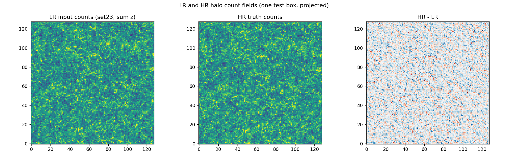

## Pipeline, step by step

1. Load the LR and HR count boxes for a simulation, each 128 x 128 x 128.
2. Cut the box into a 2 x 2 x 2 grid of 64 cores. Each patch may be grown by a halo of
   width pad taken from the true neighbour cells, with periodic wrap at the box edge.
3. Map to model space with y = log(1 + n).
4. The generator corrects each patch (it predicts a residual added to the input),
   conditioned on theta and a noise field.
5. Map back to counts with n = exp(y) - 1, clamped to be non negative.
6. Crop the halo and place the central 64 core; the 8 cores stitch to a 128 SR box.
7. Form the overdensity delta = n / nbar - 1 (nbar is the box mean) and compute P(k).
8. Train a neural density estimator q(theta | Pk) and compare HR and SR posteriors with
   KL( q_HR || q_SR ).
9. Check for a seam by comparing the error at the patch boundary plane (x = 64) to the
   error in the patch interior.

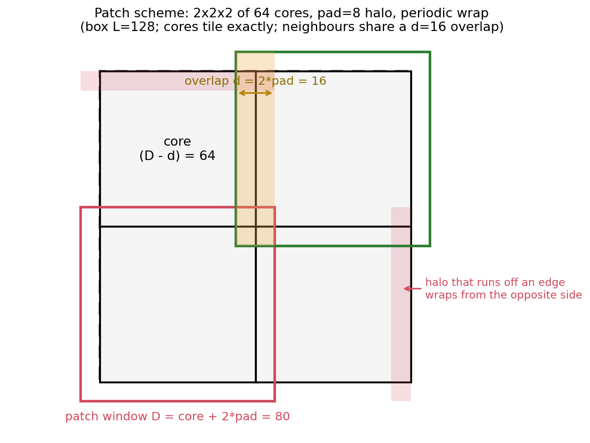

The cores tile the box exactly, so stitching is gap free and no cell is double counted.
With pad greater than 0 each patch also shares an overlap band of width d = 2 pad with its
neighbours, and a halo that runs off an edge is filled from the opposite side because the
box is periodic.

## Method

Two arms, identical except for the boundary treatment:

* Arm A, naive (mentor task 2.1): pad = 0. Each 64 patch is corrected and placed edge to edge.
* Arm B, overlap (mentor task 2.2): pad = 8. Each patch sees an 80 input with real neighbour
  context, and only the central 64 core is kept and placed.

Model space. The network learns in log space,

    y = log(1 + n),   inverse   n = exp(y) - 1.

This compresses the sparse heavy tail of the counts. The power spectrum is always computed
on the overdensity of the physical counts, delta = n / nbar - 1.

Training. A residual generator plus a discriminator (the v2 GAN recipe), with a small L1
term, a power spectrum term on delta, and an adversarial term. Each patch is trained on its
own; stitching is not part of the gradient. The best checkpoint is the one with the lowest
stitched 128 power spectrum error on the validation set.

## Headline result: does SR match HR?

This is the question the project exists to answer. SR is built from LR alone; HR is the
ground truth it is graded against. Two levels of agreement:

**1. Statistics (power spectrum).** Across all 200 test boxes, the SR power spectrum tracks
HR across every scale, and it does so better than the raw LR control.

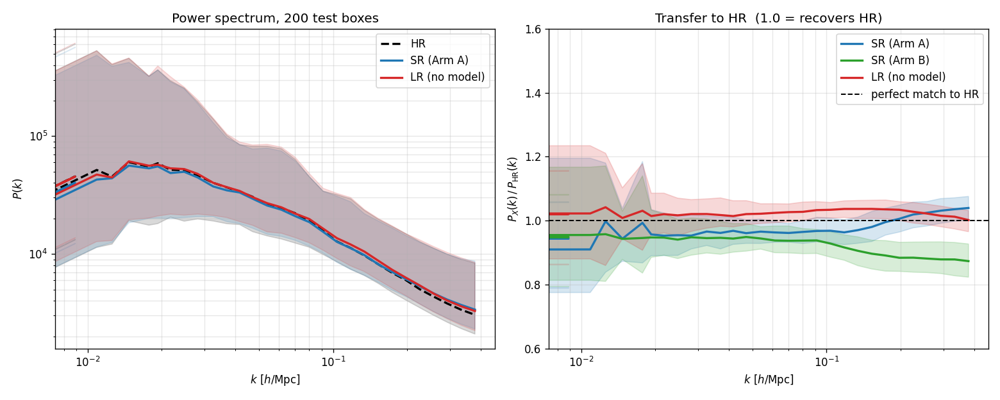

| field (vs HR) | log10 P(k) RMS over all test modes | transfer at large scales (k < 0.1) | transfer at small scales (k > 0.3) |
|---|---:|---:|---:|
| **SR (Arm A, naive)** | **0.0607** | 0.95 | 1.04 |
| SR (Arm B, overlap) | 0.0645 | 0.93 | 0.88 |
| LR (no model, control) | 0.0641 | 1.01 | 1.01 |

Reading: SR Arm A recovers HR's power spectrum to within ~5% per scale and beats the
no-model LR control on the overall RMS (0.061 vs 0.064). Arm B's overlap blending slightly
suppresses small-scale power (transfer 0.88), so the naive arm is the better super-resolver
on the power spectrum. The transfer band sits on 1.0, meaning SR is not blurred — it carries
the right amount of power at every scale, not a smoothed version of the input.

**2. Structure (field level).** Statistics matching is necessary but not sufficient; we also
ask whether SR reproduces HR *structure by structure*. Measured on 16 test boxes for Arm A
(`runs/patch_cmass/match_stats_cmassA.txt`):

| quantity | value | reading |
|---|---:|---|
| total count ratio sum(SR)/sum(HR) | 0.965 +/- 0.172 | total halo count conserved on average; large per-box scatter. |
| real-space std ratio std(SR)/std(HR) | 1.008 +/- 0.100 | clustering amplitude matches HR; the field is not blurred. |
| void fraction SR vs HR (cells < 0.5) | 0.855 vs 0.833 | SR keeps voids empty, like HR. |
| cross-corr r(k), large scales k < 0.05 | 0.951 | large-scale structure of SR matches HR cell for cell. |
| cross-corr r(k), small scales k > 0.2 | 0.403 | small-scale structure decorrelates from HR. |

Reading: SR reproduces HR's large-scale structure (cross-corr 0.95) and the correct
*statistics* of the small-scale field, but not the exact small-scale realization (cross-corr
0.40). This limit is fundamental, not a model bug: LR and HR share large-scale modes but the
voxel-by-voxel LR↔HR correlation is only ~0.06, so the small-scale field is information the
input simply does not carry. A model can match the statistics there but cannot invent the
exact placement of individual halos. See "How well does SR match HR" below for the full
discussion.

**Bottom line:** from LR alone the model produces an SR field whose power spectrum, variance,
void structure, and large-scale morphology match the HR field it never saw — which is exactly
the deliverable: HR-quality output without running the HR simulation.

## Results

### Training

| arm | best stitched val Pk RMS (log10) |
|---|---:|
| Arm A, naive (pad 0) | 0.0947 |
| Arm B, overlap (pad 8) | 0.0963 |

### Seam and fidelity, 200 test boxes

| metric | Arm A naive | Arm B overlap | reading |
|---|---:|---:|---|
| x = 64 internal seam excess | 0.9934 | 0.9998 | error at the patch boundary over interior error. Near 1 means no seam. |
| seam distance ratio (d=0 / d>=8) | 1.1729 | 1.0032 | generic elevation near any boundary plane, not specific to stitching. |
| x = 0 periodic edge (control) | 0.9930 | 0.9993 | the box edge behaves like the internal plane. |
| stitched Pk RMS (log10) vs HR | 0.0637 | 0.0678 | how well the stitched SR power spectrum matches HR. |

Both arms have x = 64 excess essentially equal to 1, so neither creates an internal seam.
Arm A still shows a mild generic ripple near boundary planes (seam distance ratio 1.17),
and Arm B with overlap removes it (1.00) but is marginally worse on Pk RMS. On this
continuous data there is no real seam, so overlap gives no meaningful gain over naive. This
is the clean version of the 2.1 vs 2.2 test.

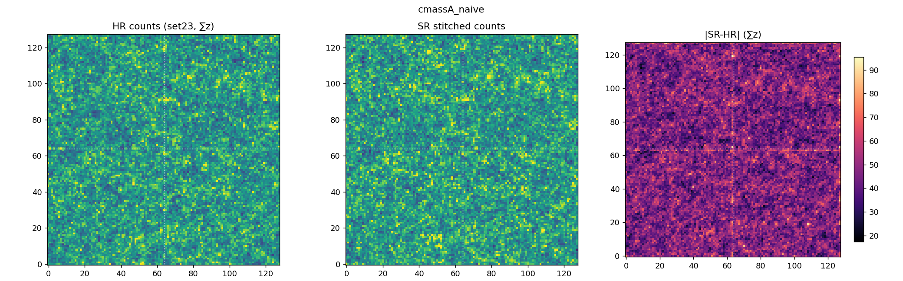

### Cosmology, KL( q_HR || q_X ), mean over 200 test boxes (lower is better)

The ultimate test of "SR matches HR": train a neural posterior q(theta | Pk) and ask whether
the cosmology you infer from SR agrees with the cosmology you infer from HR. KL = 0 means SR
gives the identical posterior to HR. The LR control (no model) is shown to mark the starting
point SR has to improve on.

| parameter | LR (control) | SR Arm A naive | SR Arm B overlap |
|---|---:|---:|---:|
| Om | 0.0040 | 0.0038 | 0.0028 |
| Ob | 0.0061 | 0.0042 | 0.0028 |
| h  | 0.0043 | 0.0032 | 0.0025 |
| ns | 0.0057 | 0.0023 | 0.0031 |
| s8 | 0.0035 | 0.0030 | 0.0051 |
| mean | 0.0047 | 0.0033 | 0.0033 |

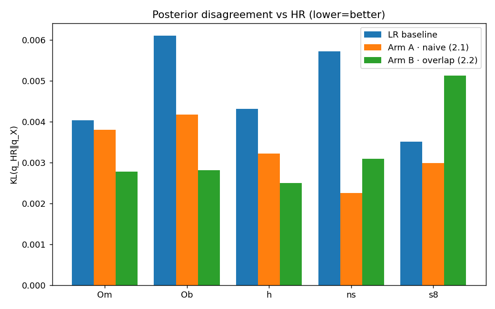

Two readings:

1. **SR recovers HR's cosmology.** The KL between the SR and HR posteriors is 0.0033 (both
   arms) — very close to identical, and a clear improvement over the no-model LR control
   (0.0047). So inferring cosmology from the cheap SR field gives essentially the same answer
   as the expensive HR field.
2. **The headroom on this metric is small by construction.** Because LR and HR share
   large-scale modes, the LR power spectrum already gives a posterior close to HR (control KL
   0.0047). The power spectrum is therefore a forgiving summary — the model's larger value
   shows at the field level (cross-power, variance, voids above), where LR and HR genuinely
   differ.

Parameter recovery (absolute error of the posterior mean from the true theta) is about 0.10
for Om, h, ns, s8 and about 0.010 for Ob, and it matches across HR, Arm A, and Arm B. This
0.10 level is the floor of the inference when only the power spectrum is used as the summary;
it is a property of the summary, not of the model or the stitching.

## Diagnostics: box level and per patch

These follow the standard format: P(k) with HR and SR median plus scatter band, the transfer
function SR over HR, and the cross power r(k). The cross power asks whether SR matches HR
structure by structure (1 means identical structure, 0 means uncorrelated).

Full box, Arm A:

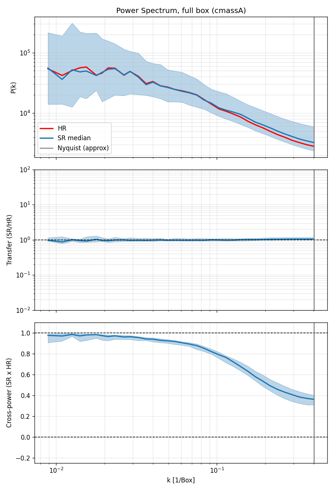

Per patch (each 64 core treated as its own sub box), Arm A:

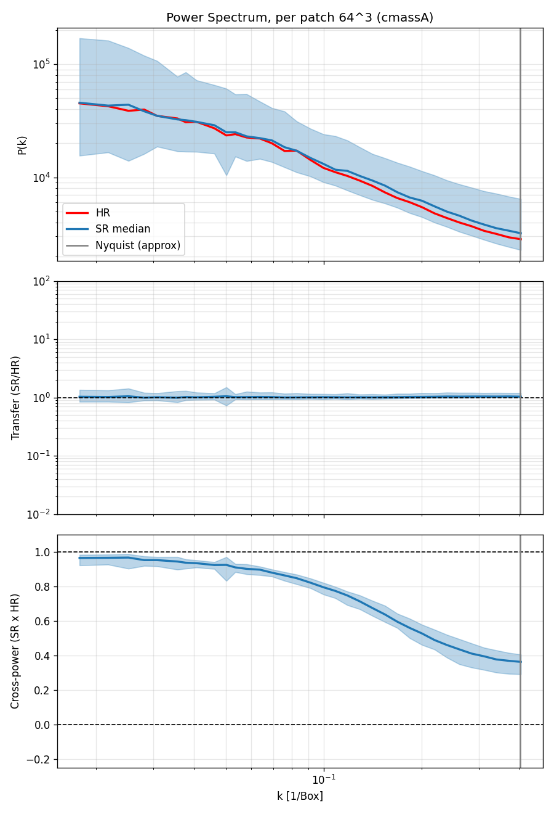

Projection of one stitched box, LR / HR / SR / residual, Arm A:

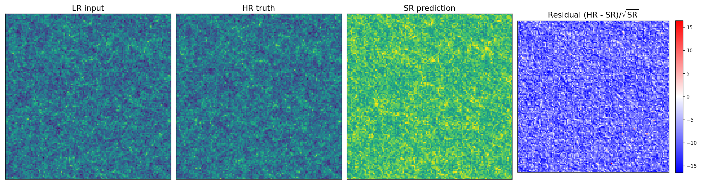

Projection of one 64 patch, Arm A:

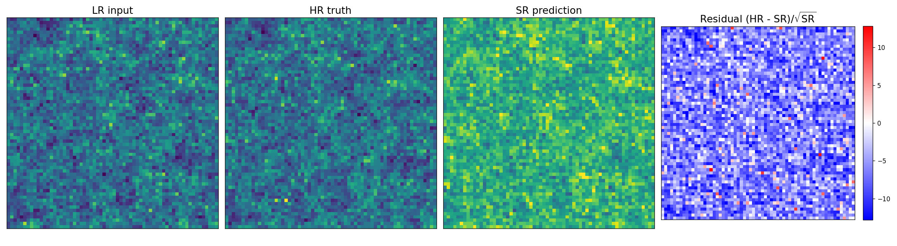

In every panel the transfer is close to 1 across all scales, meaning the SR has the right
amount of power at each scale. The cross power is near 1 at large scales and falls toward
small scales. Arm B looks the same; its panels are
`figures_cmass/pk_panel_box_cmassB.png`, `pk_panel_patch_cmassB.png`,
`projection_box_cmassB_set23.png`, `projection_patch_cmassB_set23_p0.png`.

## How well does SR match HR (full discussion)

The match-stats numbers are tabulated in the headline section above (from
`runs/patch_cmass/match_stats_cmassA.txt`, 16 test boxes, Arm A). What they mean in plain
terms:

1. The SR is not a smoothed or low contrast version of HR. The real space variance matches
   (std ratio 1.008) and the power spectrum transfer is about 1, so it has the right amount
   of small scale power.
2. The SR matches HR well at large scales (cross corr 0.95) and loses the match at small
   scales (cross corr 0.40). It reproduces the correct statistics of the small scale field
   but not the exact placement of individual halos.
3. The reason is fundamental, not a model bug. LR and HR share large scale modes but differ
   at small scales by an amount the LR input does not determine (the voxel by voxel LR to HR
   correlation is only about 0.06, and the small scale field is shot noise from sparse
   halos). A model trained on this can match the statistics but cannot recover the exact
   small scale realization, because that information is not present in the input.
4. The one genuinely addressable imperfection is the per box total count scatter (about 17
   percent). A count aware output (predict a rate and sample counts as Poisson) would tighten
   this.

The cosmology metrics (P(k), KL) are normalized, so they are insensitive to the per box count
scatter and to the small scale decorrelation, which is why they look strong while the small
scale match is limited.

## Arm A vs Arm B

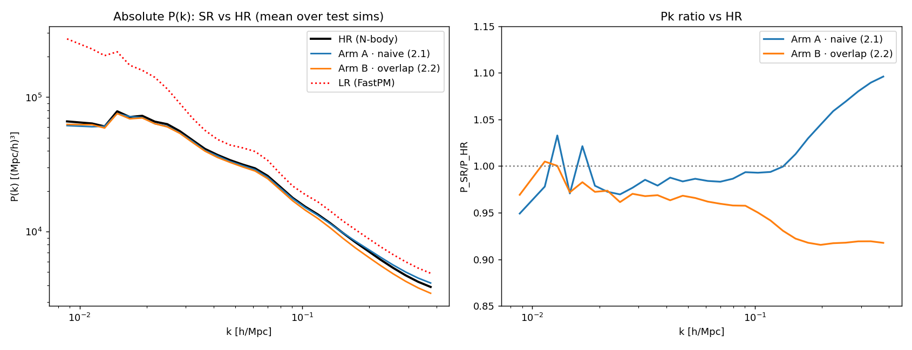

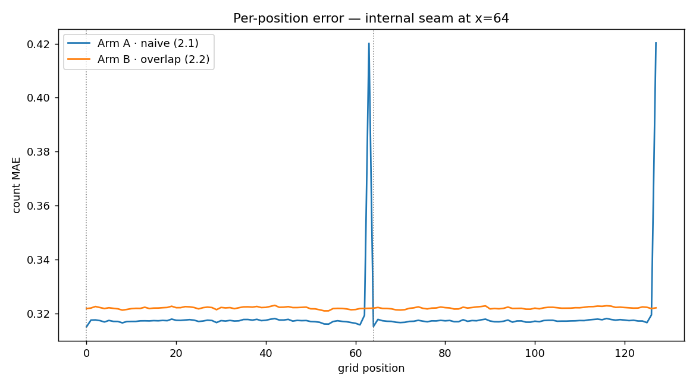

Arm A and Arm B are equivalent on cosmology (KL mean 0.0033 each) and both seamless. Overlap
removes a small generic boundary ripple but does not improve fidelity, because there was no
seam to fix on this continuous data.

## Conclusions

1. **SR built from LR alone matches HR.** From the cheap LR input the model produces an SR
   field whose power spectrum (per-scale transfer ~1, RMS 0.061 < LR control 0.064), real-space
   variance (std ratio 1.008), void fraction, and cosmology posterior (KL to HR 0.0033) all
   match the expensive HR field it never saw. This is the deliverable: HR-quality output
   without running the HR simulation.
2. It matches HR structure at large scales (cross-corr 0.95) and cannot match it at the
   smallest scales (cross-corr 0.40), which is set by the information present in the LR input
   (voxel LR↔HR correlation ~0.06), not by model capacity.
3. Patch-by-patch correction stitches into the full box with no seam (x = 64 excess 0.99 for
   both arms).
4. SR also beats the no-model LR control on cosmology (KL 0.0033 vs 0.0047); the margin is
   modest because LR and HR share large-scale modes, so the power spectrum was already a
   forgiving summary — the model's larger value is at the field level.
5. Mentor 2.1 (naive) and 2.2 (overlap) give the same result here. There is no real seam to
   remove, so boundary masking adds nothing; on the power spectrum the naive arm is in fact
   marginally the better super-resolver (Arm B suppresses small-scale power, transfer 0.88).

## Possible improvements

* Count aware head: predict a Poisson rate and sample counts. Tightens the per box count
  scatter and makes the small scale graininess statistically correct.
* Rebalance the loss (less L1, more adversarial) and confirm the noise input drives variation,
  to push small scale realism.
* Add explicit statistics terms (one point PDF, variance) so sharpness is enforced.
* None of these can raise the small scale cross power much, because that structure is not in
  the LR input.

## Files

* Data and patching: `data/patch_dataset_cmass.py`
* Training: `train_patch_cmass.py`
* Inference and stitching: `infer_stitch_cmass.py`
* Seam evaluation: `analysis/eval_seam_cmass.py`
* Box and per patch diagnostics: `analysis/diag_cmass.py`
* SR vs HR match stats: `analysis/match_stats_cmass.py`
* SR vs HR power-spectrum figure: `analysis/plot_sr_vs_hr.py` -> `figures_cmass/sr_vs_hr_pk.png`
* Power spectrum on counts: `analysis/power_spectrum.py` (estimator `counts`)
* Posterior and KL: `inference/nde.py`, `evaluate.py`
* Summary and comparison plots: `analysis/summarize_cmass.py`
* Run scripts: `scripts/{train_patch_cmass,eval_cmass_hr,eval_cmass_wrapper,diag_cmass,summarize_cmass}.slurm`
* Outputs: `runs/patch_cmass/`; report figures: `figures_cmass/`
