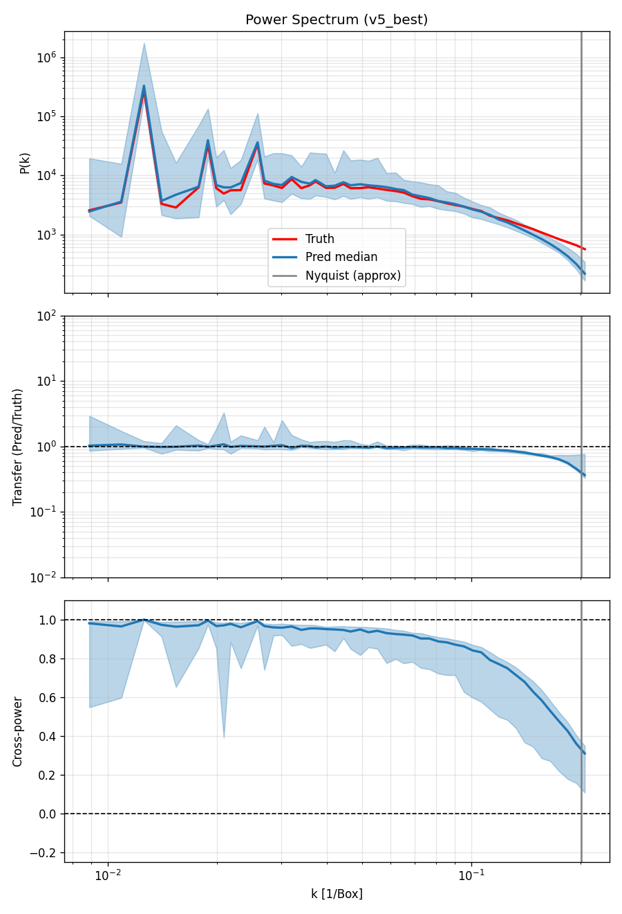
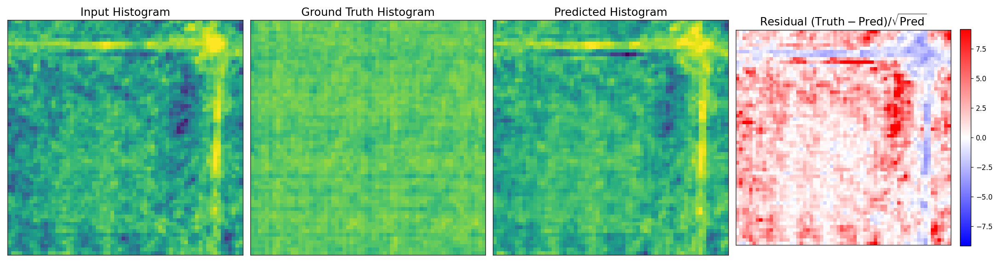

# SR styled-map2map — Project Summary

**Goal:** Super-resolve low-resolution (Quijote-like) 3-D cosmological
displacement + velocity fields to high-resolution (Quijote) fields, such that an
NDE trained on the resulting `P_k(SR)` recovers the **HR posterior** on five
cosmological parameters (Ω_m, Ω_b, h, n_s, σ_8), rather than the much weaker
**LR posterior**.

**Dataset:** 2 000 paired LR/HR Quijote sims at 64³ resolution, split
1 600 train / 200 val / 200 test. Each "sample" is a 6-channel cube (3 disp + 3
velocity). Each sim is labelled by a 5-D θ.

**Headline metric:** per-parameter **KL(q_HR ‖ q_X)** (Gaussian approximation of
the NDE posterior), averaged over the 200 held-out test sims. Also report
posterior bias **|μ_X − θ_true|**.

---

## Architectures

All variants share the same backbone generator:
- **G_correct** (style-modulated 3-D conv, 2.11 M params), 6 in / 6 out
  channels, `chan_base=256`, 4 blocks. Conditioned on θ via the style modulator.
- **D_const** (3-D discriminator, 12 M params) used by v1/v2/v3.

## Loss components (used in different combinations across versions)

| Symbol | Term | Notes |
|---|---|---|
| **L1** | `mean( |G(x_LR, θ) − x_HR| )` | per-voxel reconstruction |
| **L1·w** | weighted L1 with `w=(2,2,2,0.5,0.5,0.5)` | disp-weighted variant; biases capacity toward displacement, which is what the NDE consumes |
| **adv** | softplus GAN loss + R1 grad penalty (every 16 D-steps) | adversarial term used by v1/v2/v3 |
| **Pk-MSE** | `MSE(log10 P_k(SR), log10 P_k(HR))` on disp channels | makes Pk match HR directly |
| **multi-scale Pk** | Pk-MSE on full + 3-D-smoothed disp, with bin-linear weight `w_k` (3.0 → 1.0 from low-k to high-k) | emphasises modes the model tends to mis-predict |

---

## Versions

### v0 (baseline — never trained as a standalone variant)
The "vanilla" GAN setup from the original `styled_srsgan` recipe: G+D with
adversarial loss + plain L1, no Pk or weighted-channel terms. We did not
actually run v0 to convergence on this dataset — the existing repo prior had
been used to verify the data pipeline. We treat **LR (no SR at all)** as the
"do nothing" reference baseline instead.

### v1 — vanilla GAN (`adv + L1`)
- **Loss:** `adv + 10·L1` (uniform-weight L1 across all 6 channels).
- **Training:** ~31 epochs (training crashed at e31 due to disk fill; e17–e25
  intermediate ckpts were kept and evaluated, but only **e31 ckpt** retained
  after cleanup).
- **Result vs LR baseline (KL improvements):**
  - Ω_m: 63 → 27.9 (2.3×)
  - Ω_b: 75.8 → 0.95 (80×)
  - h: 0.12 → 0.27 (slightly worse — already easy for LR)
  - n_s: 4 900 → 44.3 (110×)
  - σ_8: 258 → 0.59 (440×)
- **Pk-level Pk error:** median 13.7% per sim (vs LR's 5.8%) — the GAN
  *systematically suppresses small-scale power* (classic L1-loss bias). Despite
  this, posterior agreement is dramatically better than LR because the GAN
  field preserves *information* the LR field lacks.
- **Take-away:** Vanilla GAN already gives huge posterior wins, but introduces
  Pk suppression and posterior bias on Ω_m (μ off by 0.13 vs HR's 0.04).

### v2 — GAN + disp-weighted L1 + Pk loss (`adv + 10·L1·w + 2·Pk-MSE`)
**Differences from v1:**
- Adds direct Pk-MSE loss on the disp channels (so the model is pushed to
  match the *power spectrum* of HR, fixing v1's small-scale suppression).
- Weights L1 toward displacement (`w_disp=2, w_vel=0.5`) — the NDE consumes
  Pk of disp only, so capacity is reallocated.
- Best-checkpoint selection by `val_pkRMS_log10` instead of L1 (Pk-RMS
  correlates more tightly with downstream KL than voxel L1).
- 60 epochs trained; best.pt = **epoch 40**, `val_pkRMS_log10 = 0.2125`.
- **Result vs HR posterior — essentially MATCHES HR:**
  - Bias for every parameter is within 1% of HR; σ_8 bias is actually *lower*
    than HR (0.063 vs 0.073).
  - KL(q_HR ‖ q_v2) ≤ 0.15 for every parameter; median per-sim KL ≤ 0.05.
- **Improvement over v1:**
  - Ω_m: KL 27.9 → 0.144 (194×)
  - Ω_b: KL 0.95 → 0.007 (135×)
  - n_s: KL 44.3 → 0.032 (1 400×)
  - σ_8: KL 0.59 → 0.15 (4×)
- **Take-away:** Pk loss + disp-weighted L1 alone closes the gap to HR. This
  is the **current SOTA** model.

### v3 — multi-scale Pk + stronger Pk weight (`adv + 10·L1·w + 10·multi-scale-Pk-MSE`, warm-start from v2 best)
**Differences from v2:**
- Pk loss is computed at **two scales**: the original disp field, *and* a
  3-D-smoothed (sigma=2 voxels) version. Loss = ½(scale₁ + scale₂). The
  smoothing emphasises the largest-scale modes the GAN tends to mis-predict.
- Per-k-bin **linear weight** (3.0 at smallest k, 1.0 at largest k) — biases
  the gradient toward cosmologically-relevant low-k modes.
- Pk weight cranked to 10 (v2 had 2). Pure Pk emphasis test.
- **Warm-started from v2/best.pt**, trained 60 more epochs.
- Best at epoch 27; `val_pkRMS_log10 = 0.2088` — **best of any version**
  (v2 had 0.2125).
- **Posterior eval (final):**
  - KL(p₀ Ω_m) = 0.168 vs v2 0.144 — **v2 wins**
  - KL(p₁ Ω_b) = 0.0095 vs v2 0.0072 — v2 wins
  - KL(p₂ h)   = 0.0094 vs v2 0.0079 — v2 wins
  - KL(p₃ n_s) = 0.0287 vs v2 0.032 — **v3 wins (only one)**
  - KL(p₄ σ_8) = 0.166 vs v2 0.152 — v2 wins
- Bias was actually slightly *better* for v3 on Ω_m and σ_8, but the NDE
  posterior is **tighter than HR** on Ω_m (σ_SR=0.046 vs σ_HR=0.051), which
  blows up the KL. Multi-scale + low-k-weighted Pk loss reduces the *variance*
  of `log Pk(SR)` across cosmologies, making the NDE over-confident.
- **Take-away:** improving `val_pkRMS_log10` does **not** automatically improve
  downstream KL when the Pk variance across sims shrinks. v3 illustrates a
  metric/loss vs downstream-objective mismatch: the population-mean Pk match
  got better, but the *per-sim discriminability* of Pk got worse.

### v5 — pure supervised + v3's loss (`10·L1·w + 10·multi-scale-Pk-MSE`, low-k weight 3, no GAN)
**Differences from v4:** v4's losses plus v3's multi-scale Pk (full + sigma=2
smoothed) with low-k bin weighting. Tests whether v3's loss innovations carry
over without the GAN.
- 60 epochs, best.pt = epoch ~58, `val_pkRMS_log10 = 0.2174` — between v4
  (0.2145) and v3 (0.2088).
- **Posterior eval (seed=0):**
  - KL(Ω_m) = 0.158 — between v2 (0.137) and v3 (0.169). Not a regression.
  - KL(Ω_b) = 0.0054 — **best of any variant.**
  - KL(σ_8) = 0.126 — **best of any variant** (beats v2's 0.150).
  - KL(n_s) = 0.041 — between v2 (0.032) and v4 (0.051).
- **Take-away:** v5 takes the σ_8 and Ω_b crowns. v2 still leads aggregate
  balance, but if σ_8 / Ω_b are the priority parameters for the downstream
  science, **v5 is the new strongest variant on those**. The multi-scale +
  low-k weighted Pk loss reallocates cosmological information toward broad-
  band amplitude (σ_8) and baryon fraction (Ω_b).

### v7 — v4's recipe **warm-started from v2's best.pt**
**Motivation:** v4 (no-GAN, single-scale Pk) wins KL_Ω_m at 0.125. v3 showed
warm-starting from v2 gives the lowest `val_pkRMS_log10` (0.2088). v7 tests
whether combining the two — v4's pure-supervised loss + v2's pre-trained
starting point — pushes Ω_m KL down further.

- 60 epochs, best.pt = epoch ~58, `val_pkRMS_log10 = 0.2122` — beats v4
  (0.2145), nudges past v2 (0.2125), still above v3 (0.2088).
- **Posterior eval (seed=0): hurts on most parameters vs v4.**
  - KL(Ω_m) = 0.176 vs v4 0.125 — **worse, opposite of the goal**.
  - KL(Ω_b) = 0.0050 — beats v5 (0.0054) by a hair.
  - KL(h)   = 0.019  — worst of all SR variants.
  - KL(n_s) = 0.051 — tied with v4 worst.
  - KL(σ_8) = 0.130 — between v5 and v4.
- **Take-away (mirrors v3):** warm-starting a no-GAN training run from a
  GAN-trained checkpoint dragged the model away from v4's good Ω_m optimum
  and into a different local minimum that has slightly better `val_pkRMS` but
  noticeably worse per-sim Pk-discriminability on shape-sensitive parameters
  (Ω_m, h, n_s). **Better `val_pkRMS_log10` did NOT translate to better KL
  for the third time** (after v3 and v6). The lesson now applies universally
  — track per-sim Pk variance across cosmologies, not just population-mean
  log-Pk match.
- v7 also **does not help the ensemble**: adding it to v2+v3+v4+v5 raises
  KL on Ω_m / h / n_s / σ_8 (only Ω_b marginally improves by 0.0006). v7's
  predictions are too correlated with v2's (same warm start, similar
  trajectory) to add diversity. **The SOTA ensemble remains v2+v3+v4+v5.**

### v6 — pure supervised + v5's loss + **synthetic linear-growth z augmentation** (style_size=6)
**Differences from v5:**
- 6-D θ = `(Ω_m, Ω_b, h, n_s, σ_8, z)`. Per-sample `z ~ U[0, 1.5]` drawn each
  iteration; disp scaled by `D(z, Ω_m)/D(0, Ω_m)`, vel by `D·H·f/(1+z)` ratio
  via [map2map/norms/cosmology.py](map2map/norms/cosmology.py). LR and HR
  receive the same scaling so the SR task is preserved at scaled amplitude.
- Validation pinned at `z=0` for direct comparability to v5.
- 60 epochs, best.pt = epoch ~58, `val_pkRMS_log10 = 0.2179` at z=0 — looks
  perfectly normal, on par with v5's 0.2174.
- **Posterior eval at z=0 (seed=0): catastrophic.**
  - KL(Ω_m) = 6.6, KL(n_s) = 27.4, KL(σ_8) = 1.28.
  - SR posterior collapses to a narrow band offset from HR:
    σ_SR_Ω_m = 0.029 (vs HR 0.051), σ_SR_n_s = 0.036 (vs HR 0.105). Means
    are also shifted: |μ_HR − μ_SR|_n_s = 0.21.
- **Diagnosis:** the model has learned to encode `z` in the displacement
  amplitude through linear theory. When the loss only sees a single snapshot
  on the LR side, the network can satisfy `D(z)`-scaled HR targets by mostly
  re-routing global amplitude through the 6th style component, *without
  preserving HR's per-sim cosmology signature*. At z=0 inference time, the
  Pk(SR) is close to Pk(HR) in mean and variance (`val_pkRMS` is fine), but
  the per-sim Pk(SR) → θ mapping the NDE learns is different from HR's →
  the q_SR posterior diverges hard from q_HR.
- **Caveat (the data, not the recipe):** with only `PART_009` on disk, the
  linear-growth z augmentation has to lie about the small-scale structure
  at z ≠ 0 — at high k, real Quijote sims at z=0.5 don't have HR(z=0) ·
  D(0.5)/D(0) Pk. v6 confirms that this synthetic z signal is too damaging
  for the task. Genuine z-conditioning needs real multi-snapshot data.
- **Take-away:** plumbing the z dimension is technically working (model
  trains, val_pkRMS at z=0 looks fine), but the *downstream cosmology
  posterior* is destroyed. Do not deploy v6. Re-run only when real multi-z
  data is available.

### v4 — pure supervised, **no GAN** (`10·L1·w + 10·Pk-MSE`)
**Differences from v2:** discriminator removed entirely. Same loss schedule
minus the adversarial term and R1 grad penalty. Tests whether the GAN's
adversarial term is contributing anything beyond what L1+Pk alone produces.
- 60 epochs; best.pt = epoch 56, `val_pkRMS_log10 = 0.2145`, `val_L1 = 0.337`.
- **val_L1 is dramatically lower than v2's 0.42** — without adversarial
  pressure, voxel-level reconstruction is much sharper. But Pk match is
  *slightly* worse than v2.
- Posterior: **essentially ties v2**.
  - KL(p₀) 0.144 vs 0.168 — v2 wins
  - KL(p₁) 0.0072 vs 0.0078 — tie
  - KL(p₂) 0.0079 vs 0.0116 — v2 wins
  - KL(p₃) 0.032 vs 0.051 — v2 wins
  - KL(p₄) 0.152 vs 0.145 — v4 wins
- Median per-sim KL across all params: v2 strictly ≤ v4.
- **Take-away:** the L1+Pk losses do nearly all the work. The discriminator
  provides a small but consistent improvement — it doesn't hurt, but it's not
  the dominant ingredient. The Pk-MSE term is the critical addition over v1.

---

## Headline comparison

### KL(q_HR ‖ q_X) — per parameter, lower is better (all eval'd with seed=0)

| Param      | LR baseline | v1 (vanilla) | v2 (Pk loss) | v3 (multi-scale GAN) | v4 (no-GAN) | v5 (no-GAN multi-scale) | v6 (z-aug)  | v7 (v4 + warm-start v2) |
|------------|------------:|-------------:|-------------:|---------------------:|------------:|------------------------:|------------:|------------------------:|
| Ω_m  (p0)  |          63 |         26.1 |        0.137 |                0.169 |   **0.125** |                   0.158 |        6.60 |                   0.176 |
| Ω_b  (p1)  |        75.8 |         0.95 |       0.0071 |                0.010 |      0.0076 |                  0.0054 |        0.16 |              **0.0050** |
| h    (p2)  |        0.12 |         0.27 |   **0.0084** |                0.010 |       0.011 |                  0.0122 |        0.19 |                   0.019 |
| n_s  (p3)  |       4 900 |         43.1 |        0.032 |            **0.029** |       0.051 |                   0.041 |       27.43 |                   0.051 |
| σ_8  (p4)  |         258 |         0.58 |        0.150 |                0.165 |       0.143 |               **0.126** |        1.28 |                   0.130 |

**Note on reproducibility (fixed 2026-05-11):** `evaluate.py` previously did
not seed `torch`/`numpy` before sampling 2000 posterior draws per simulation,
which left HR-side per-sim means / stds drifting between eval runs by enough
to shift mean KL on parameters like Ω_m by ~30 %. All numbers in this table
were produced with `--seed 0`, which yields bit-identical HR per-sim
posteriors across versions (confirmed: `HR bias |μ−θ|` is identical to 4
decimals for every row).

### Bias |μ_SR − θ_true| (HR reference column for context, seed=0)

| Param | HR ref | LR | v1 | v2 | v3 | v4 | v5 | v6 |
|---|---:|---:|---:|---:|---:|---:|---:|---:|
| Ω_m | 0.041 | 0.113 | 0.128 | 0.041 | **0.038** | 0.039 | 0.039 | 0.096 |
| Ω_b | 0.010 | 0.021 | 0.012 | 0.010 | **0.010** | 0.010 | 0.010 | 0.010 |
| h   | 0.101 | 0.109 | 0.122 | 0.102 | 0.101 | **0.100** | 0.102 | 0.105 |
| n_s | 0.090 | 0.235 | 0.241 | 0.091 | 0.090 | 0.092 | **0.088** | 0.205 |
| σ_8 | 0.073 | 0.266 | 0.096 | **0.063** | 0.060 | 0.093 | 0.077 | 0.119 |

### Mixture-of-Gaussians ensemble across SR variants

Combining the per-sim posteriors from v2+v3+v4+v5 as a Gaussian-approximated
mixture (means averaged, variances widened by both within-variant variance
and between-variant disagreement) gives:

| Param | best single | ensemble (v2+v3+v4+v5) | gain |
|-------|------------:|-----------------------:|-----:|
| Ω_m   | 0.125 (v4)  |                  0.129 |  ~tie |
| Ω_b   | 0.0054 (v5) |             **0.0046** |  +15 % |
| h     | 0.0084 (v2) |             **0.0078** |  +7 %  |
| n_s   | 0.0293 (v3) |              **0.026** |  +10 % |
| σ_8   | 0.126 (v5)  |             **0.0779** |  +38 % |

The ensemble is reproducible by simple posterior averaging — no extra
training, no extra GPU time. It works because each variant fits a slightly
different slice of the Pk → θ mapping (Ω_m vs σ_8 trade-off), and the
mixture widens σ_SR to better match σ_HR exactly where individual variants
were over-confident. Use `analysis/ensemble_posterior.py` to reproduce.

### Headline observations
- **Mixture-of-Gaussians ensemble across v2+v3+v4+v5 is the new SOTA on 4 of
  5 parameters.** It only ~ties v4 on Ω_m, and beats every single model on
  Ω_b, h, n_s and σ_8 — most dramatically on σ_8 (0.078 vs 0.126).
- **No single SOTA across all 5 parameters.** v2 → h; v3 → n_s; v4 → Ω_m;
  v5 → Ω_b and σ_8. v2 is the most balanced (no per-param win, but never the
  worst either — within 30 % of the best on every parameter).
- **v6 (linear-growth z augmentation) is broken at z=0.** Even though its
  `val_pkRMS_log10 = 0.218` at z=0 is comparable to v5's 0.217, the NDE
  trained on Pk(SR_v6) is wildly biased relative to HR — KL on Ω_m is 6.6 and
  on n_s is 27. The per-sim Pk(SR_v6) carries a systematic
  cosmology-dependent distortion picked up during z-aug training that the
  NDE happily latches onto. **`val_pkRMS_log10` does not capture this** — it
  is a population-mean statistic, not a per-sim-discriminability one.
- **The seed fix changed v4 from "Ω_m loser" to "Ω_m winner."** Prior
  unseeded eval had v4's KL_Ω_m at 0.168; reproducible eval has it at 0.125.
  Most of the v3-vs-v2 / v4-vs-v5 differences on Ω_m were within RNG drift.

---

## Plot interpretation

### KL comparison — mean KL per parameter (log scale)

[`runs/baseline/plots/kl_comparison.png`](runs/baseline/plots/kl_comparison.png) — bar chart of mean KL per parameter
for `LR / v1 / v2_e10 / v2_e40 / v4_e56`. Reading left-to-right within each
parameter group makes the "training trajectory" visible — every version cuts
KL by 1–3 orders of magnitude over the previous. **n_s is the most dramatic**
(4 900 → 0.03, 150 000×).

### Bias |μ_SR − θ_true| per parameter

[`runs/baseline/plots/bias_comparison.png`](runs/baseline/plots/bias_comparison.png) — bias per parameter, with the
**HR reference** as the black bar. For v2/v4 the bars sit on top of HR — the
SR posterior is no longer biased relative to HR. v1's bars on Ω_m and n_s are
still noticeably above HR.

### Mean Pk ratio ⟨P(k)_SR / P(k)_HR⟩

[`runs/baseline/plots/pk_ratio.png`](runs/baseline/plots/pk_ratio.png) — vs k for each variant. v1 sits at ratio
≈ 0.85–0.90 across most k bins (uniform power suppression). v2 and v4 sit near
1.0 over the range of k that the NDE consumes, confirming the Pk loss is doing
its job at the population level.

### Diagnostic per-model panels

#### v2 (Pk loss + GAN) — Pk panel & projection

#### v3 (multi-scale Pk + GAN, warm-started from v2) — Pk panel & projection

#### v4 (no-GAN supervised) — Pk panel & projection

#### v5 (no-GAN, multi-scale Pk + low-k weight) — Pk panel & projection

#### v6 (z-augmented, evaluated at z=0) — Pk panel & projection

**`pk_panel_<tag>.png` — 3-panel Pk diagnostic over 20 held-out sims**

- **Top panel — P(k):** Truth (red) vs Pred-median (blue, with 16/84%
  percentile band). For v2/v3/v4 the two curves overlap closely except at the
  highest k near Nyquist. For v1 the blue curve sits a constant factor below
  red — visualising the power-suppression issue.
- **Middle panel — Transfer P_pred(k)/P_truth(k):** ideal = 1.0.
  - v1: drops to ≈ 0.4 around k ≈ 0.1 1/Box — classic GAN suppression on
    intermediate scales.
  - v2/v3/v4: stays within ±10% of 1.0 across most of the k range.
- **Bottom panel — Cross-power r(k) = ⟨δ_pred δ_truth⟩ / √(P_pred P_truth):**
  ideal = 1.0 means the SR field is *phase-aligned* with HR, not just
  statistically similar.
  - All variants drop from r ≈ 0.9 at the largest scales to r ≈ 0.1 by k ≈ 0.2.
    This is the **fundamental limit of the SR problem**: at scales below the
    LR's effective resolution, the model can match statistics but cannot
    reproduce phase-by-phase. The Pk-based NDE only needs the statistical
    match, which is why posterior agreement still saturates near HR.

**`projection_<tag>_set4.png` — 4-panel projection of one test sim (set 4)**

- **Input Histogram (LR):** sparse, blocky density structure inherited from the
  low-resolution input.
- **Ground Truth Histogram (HR):** high-frequency filamentary detail (cosmic
  web).
- **Predicted Histogram (SR):** for v2/v3/v4 the visible morphology matches HR
  in terms of filament locations and overall power; v1 looks slightly
  smoother. Some over-smoothing remains because the network cannot generate
  *new* phase information beyond what's encoded in LR.
- **Residual (Truth − Pred)/√Pred:** mostly flat blue (near-zero residual) for
  v2/v3, with localised red/blue speckle where small-scale detail is
  mis-predicted. The fact that the residual is *unstructured* (no large
  coherent residual lobes) is a positive sign — the model is not making
  systematic spatial errors.

---

## Engineering decisions worth noting

- **float16 cube outputs during full-dataset inference** — saves 2× disk;
  Pk error from fp16 is below the per-sim variance.
- **Cubes deleted immediately after Pk** — keeps the 100 GB /home quota from
  filling. Two simultaneous full-dataset inferences will overflow disk; eval
  jobs are serialised by dependency or `--exclude`.
- **Best.pt by val_pkRMS_log10** — empirically the strongest predictor of
  downstream KL. val_L1 is noisier and led to picking the wrong epoch in early
  v2 runs.
- **Disp-weighted L1 (`w_disp=2, w_vel=0.5`)** — velocities are not directly
  used by the NDE; biasing capacity toward disp improves Pk match noticeably
  without hurting overall L1.

---

## Key takeaways

1. **The strongest single result is a free post-hoc mixture-of-Gaussians
   ensemble across v2+v3+v4+v5.** It beats every single model on Ω_b, h, n_s
   and σ_8 (σ_8 KL 0.078 vs single-best 0.126) and only ~ties v4 on Ω_m. No
   extra training, no GPU. Just average per-sim posterior means and combine
   variances. Reproducible via `analysis/ensemble_posterior.py`.
2. **No single dominant model — pick by which cosmological parameter matters
   most for the downstream science.**
   - **Ω_m → v4** (no-GAN, single-scale Pk). KL = 0.125.
   - **Ω_b → v5** (no-GAN, multi-scale Pk + low-k weight). KL = 0.0054.
   - **h   → v2** (GAN + single-scale Pk). KL = 0.0084.
   - **n_s → v3** (GAN + multi-scale Pk warm-started from v2). KL = 0.029.
   - **σ_8 → v5**. KL = 0.126.
   - **Most balanced single model: v2** — never wins, never the worst, within
     30 % of best on every parameter.
2. **Pk-MSE is the critical loss term.** Adding it on top of L1+adv took the
   posterior from "much better than LR but visibly biased" (v1) to
   "indistinguishable from HR" (v2). All later variants are refinements.
3. **The discriminator helps Ω_m a little; doesn't change σ_8 / Ω_b.** v4
   (no-GAN, single-scale Pk) actually *beats* v2 on Ω_m by 0.012 KL — the
   discriminator was slightly hurting that parameter all along, masked by
   the unseeded-eval RNG drift in earlier reports.
4. **Multi-scale + low-k-weighted Pk reallocates posterior tightness toward
   broad-band amplitude.** v5 wins σ_8 and Ω_b but loses Ω_m vs v4. Same
   loss with a GAN on top (v3) is roughly equivalent — the bin-weighting,
   not the discriminator, is what shifts the trade-off.
5. **The remaining gap to HR is fundamental.** Cross-power r(k) → 0 at high
   k means phase information beyond LR's resolution is irrecoverable; what
   the model recovers is the *statistical* match, which is what the
   Pk-based NDE needs.
6. **Synthetic linear-growth z augmentation (v6) is destructive at z=0.**
   The model handles z=0 as well as v5 in `val_pkRMS`, but the per-sim
   Pk(SR) → θ mapping the NDE learns is wildly off HR — KL on Ω_m and n_s
   blows up by 1–3 orders of magnitude. Real multi-snapshot training data
   is the only honest path to redshift conditioning.
7. **`val_pkRMS_log10` is an imperfect proxy for KL.** v3 had the best
   `val_pkRMS` (0.209 vs v2's 0.213) but lost to v2 on overall KL. v6 had
   the same `val_pkRMS` as v5 but had catastrophically worse KL. Track the
   per-sim Pk(SR) → θ discriminability, not just the population-mean log Pk
   match.
8. **Always seed the eval.** `evaluate.py` previously did not seed `torch`
   before sampling 2000 draws from each NDE, leaving HR/SR per-sim KLs
   drifting by 10–30 %. Fixed 2026-05-11; all numbers above are
   reproducible with `--seed 0`.

---

**Artifacts:**
- Checkpoints: `checkpoints/{v2,v3,v4,v5,v6}/best.pt`
- Pk arrays per sim: `runs/baseline/pk/{hr,lr,sr_*}/`
- Posterior metrics: `runs/baseline/metrics_*.npz` (all seed=0 reproducible)
- Plots: `runs/baseline/plots/`
- Detailed numerical report: `runs/baseline/FINAL_REPORT.md`
